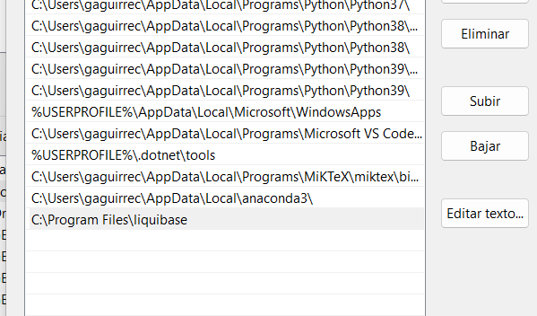
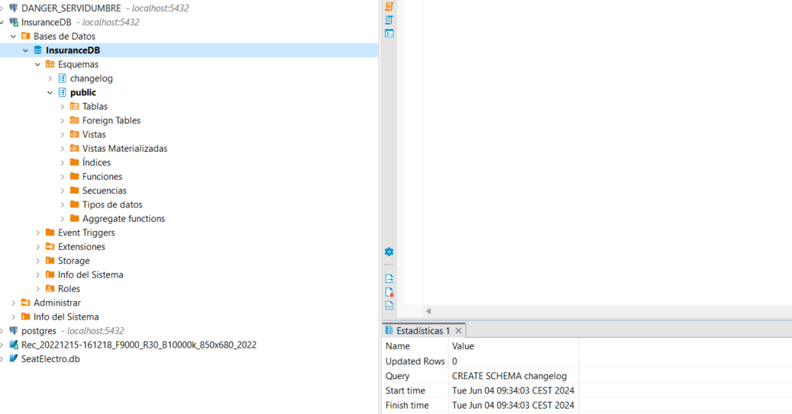
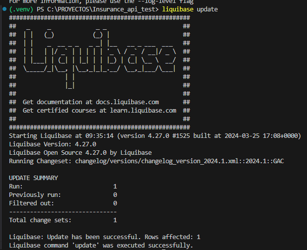
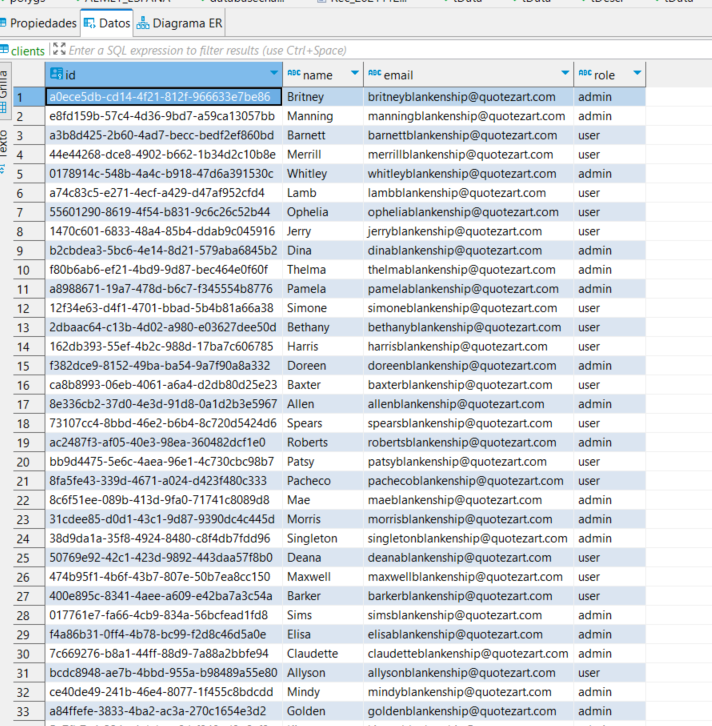
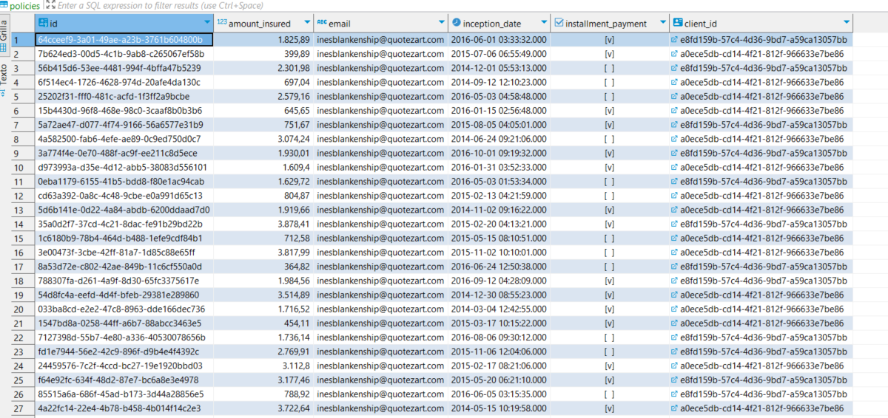

## User and Policy Management Application
# Overview

This is a web application designed for managing user data and insurance policies. It allows users to authenticate, search for user information, and retrieve policy details based on various criteria.

-------------------------------------------------------------------------------------------------------------------
# Technologies Used
-> Python
-> Flask
-> SQLAlchemy
-> Pandas
-> PostgreSQL
-> HTML/CSS
-> Docker
-> Liquibase
-> Github

Github to control versions  https://github.com/guille921209/Insurance_api

--------------------------------------------------------------------------------------------------------------------------

## Steps to Set Up the Virtual Environment
You need to create a virtual environment and then install the requirements from the terminal. You can follow these steps. It is assumed that you are using 'virtualenv', but the steps are similar if you are using 'conda'.

*** Python Version: Python 3.11.0

 ** Create a Virtual Environment:
Open the terminal and navigate to the directory where you want to create the virtual environment.

-> Run the following command to create a virtual environment named ".venv" (you can change the name as per your preference)
python -m venv .venv
This will create a folder named ".venv" in your current directory with the virtual environment.

** Activate the Virtual Environment

In the same terminal, activate the virtual environment:

On Windows: .\venv\Scripts\activate
You will see the terminal prompt change to indicate that you are now inside the virtual environment.

** Install Requirements from requirements.txt:

With the virtual environment activated, navigate to the directory that contains your requirements.txt file.

Run the following command to install the requirements:
pip install -r requirements.txt 

These steps will set up your virtual environment and install the necessary dependencies for your project.

--------------------------------------------------------------------------------------------------------------------------
## Database Setup

** Start PostgreSQL Database with Docker

Ensure Docker is installed and running on your machine. Use the provided docker-compose.yml to set up the PostgreSQL database.

++++++ docker-compose up -d +++++++++++++++++++++++

We will have created the DataBase with the name Insurance DB, I use DBeaver to control de DB
We could have the database already created with all the data inside, but I will explain the entire flow of how it was generated so that you can follow it. Installing liquibase can be a bit complicated, but if you have any questions, feel free to write to me.

Additional Considerations:

Permissions: Ensure the user account you're using for Liquibase has the necessary permissions to create schemas in the target database.

Database Compatibility: Check the documentation for your specific database system to ensure there are no additional requirements or considerations when creating schemas.

By following these approaches, you can effectively create the changelog schema beforehand, ensuring a smooth and successful Liquibase migration process.

** Configure Liquibase

Ensure Liquibase is installed on your machine. Update the liquibase.properties file with your database connection details if necessary.

Important you have to add on the environment variable the liquibase folder , for example: 

Important Creating the schema manually:

You can also manually create the changelog schema using your database's administration tools or SQL client. The specific commands will vary depending on your database system.

Example for PostgreSQL:

SQL
CREATE SCHEMA changelog;

Once you've created the changelog schema manually, you can proceed with applying Liquibase migrations without encountering the schema-does-not-exist error.

** Run Liquibase to Apply Database Changes 

Navigate to the directory containing your Liquibase main.xml file and run: liquibase update
The main.xml references SQL files located in the relative path BASE_DATOS_SQL\030624 which contain the DDL and rollback scripts for the initial tables.

** Initial Data Population

Once the database is set up and the tables are created, populate the initial data using the initial_data.py script.

batchproject\initial_data.py

The initial_data.py script is responsible for populating the database with initial data after the database structure has been set up. Here’s how it works:

Database Connection: It establishes a connection to the PostgreSQL database using SQLAlchemy.
Data Preparation: The script prepares the initial data for the clients and policies tables. This data can be hardcoded in the script or loaded from an external file (e.g., CSV, JSON).
Data Insertion: It inserts the prepared data into the respective tables using SQLAlchemy’s ORM capabilities.

---------------------------------------------------------------------------------------------------------------------
## How It Works
+++++++ run.py +++++++
This is the main file to run the application. It sets up the Flask app, defines the routes, and starts the server. The routes include:

** Authentication
Route: /
Template: index.html
Users enter their ID to authenticate. The system checks if the user is an admin or a regular user and redirects them accordingly.

** User Query
Route: /query_user_page
Template: user_query.html
Displays user details based on the user ID provided. Admin users have additional options to search for policies and users linked to policies.

** Search User by Name
Route: /search_user_page
Template: search_by_name.html
Allows users to search for user information by entering a user's name.

** Search Policies by User Name
Route: /search_policies_page
Template: search_policies_by_name.html
Admin-only feature to search for all policies linked to a user's name.

** Search User by Policy Number
Route: /search_user_by_policy_page
Template: search_user_by_policy.html
Admin-only feature to search for a user based on a policy number.

**Restrictions and Permissions
Admin Users: Access to all features.
Regular Users: Can only search for their own information.
Unauthenticated Users: Cannot access any features without providing a valid user ID.

++++++ batchproject\auth.py +++++++

This file handles the authentication logic. It includes functions to check if a user is an admin or a regular user and to fetch user details from the database. It interacts with the PostgreSQL database using SQLAlchemy and Pandas.